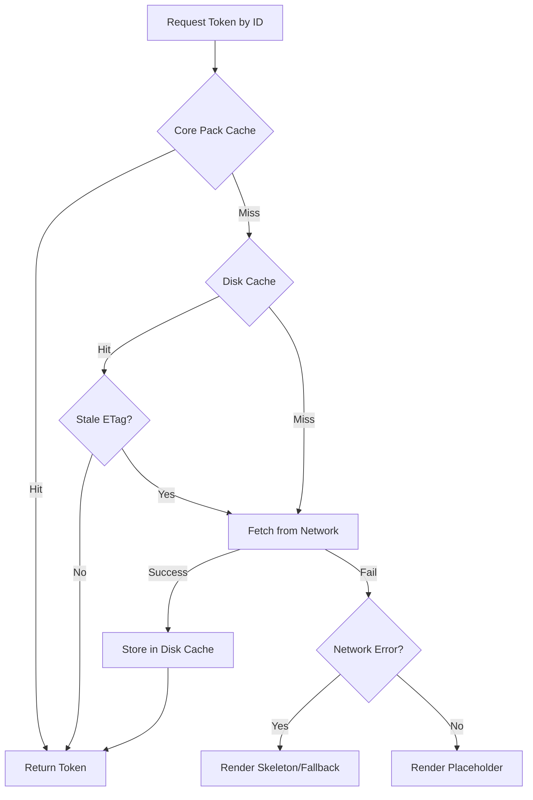

# Dynamic-Token SDUI Requirements Document

**Version 0.9 — July 12 2025**

---

## 1. Purpose

Define the client- and server-side changes required to:

* Embed a **Core-Token Pack** in the mobile binary.
* Fetch and cache **extended tokens** on demand.
* Guarantee render-time compatibility through an explicit **primitive-version contract**.
* Achieve offline resilience, hot updates, and low first-paint latency.

---

## 2. Glossary

| Term                | Meaning                                                                                |
| ------------------- | -------------------------------------------------------------------------------------- |
| **Primitive**       | A hard-coded UI building block (`Column`, `Text`, etc.) shipped in the app.            |
| **Design Token**    | JSON description that references primitives plus parameters (`padding`, `background`). |
| **Core-Token Pack** | Gzipped bundle of the top-N tokens baked into the APK/IPA at build time.               |
| **Primitive Map**   | Header sent by the client, e.g. `Column@3,Text@4,…`, listing supported versions.       |

---

## 3. High-Level Flow

1. **Screen request** → `/screens/{id}` (client header `X-Primitives`).
2. Server returns `ScreenPayload` (array of **token IDs** + bindings).
3. Client checks local store.
4. Cache misses batched to `/design-tokens?ids=…&v=…`.
5. Tokens persisted (SQLite / file) with TTL + ETag.
6. Renderer composes primitives into the final UI.

```mermaid
sequenceDiagram
    participant Client
    participant Server
    participant "Client Cache (Core + Disk)"

    Client->>Server: GET /screens/{id}<br>Header: X-Primitives: Col@3,Txt@4
    activate Server
    Server-->>Client: 200 OK<br>ScreenPayload (token IDs)
    deactivate Server

    Client->>"Client Cache (Core + Disk)": Check for token "promo_banner"
    "Client Cache (Core + Disk)"-->>Client: Cache Miss
    Client->>"Client Cache (Core + Disk)": Check for token "team_list"
    "Client Cache (Core + Disk)"-->>Client: Cache Hit

    Client->>Server: GET /design-tokens?ids=promo_banner
    activate Server
    Server-->>Client: 200 OK<br>DesignToken JSON
    deactivate Server

    Client->>"Client Cache (Core + Disk)": Store "promo_banner"
    Client->>Client: Render UI from tokens
```

---

## 4. Functional Requirements

### 4.1 Client

| ID  | Requirement                                                                                                                                            |
| --- | ------------------------------------------------------------------------------------------------------------------------------------------------------ |
| C-1 | Ship primitives as a Kotlin/Swift library versioned with SemVer.                                                                                       |
| C-2 | Load Core-Token Pack on startup to an immutable `Map<String,DesignToken>`.                                                                             |
| C-3 | Provide `TokenRepository` with lookup (`get(id) : Flow<DesignToken>`), disk cache, network fetch, and LRU eviction (default `maxEntries = 5 000`).     |
| C-4 | Add `X-Primitives` header on every `/screens` call (comma-separated `primitive@version`).                                                              |
| C-5 | Fallback rules:<br>• Unknown primitive → log + placeholder.<br>• Stale token (ETag mismatch) → re-fetch.<br>• No network + cache miss → skeleton view. |



### 4.2 Server

| ID  | Requirement                                                                                                                    |
| --- | ------------------------------------------------------------------------------------------------------------------------------ |
| S-1 | Maintain a registry table **`design_tokens(id, version, json, primitive_version)`**.                                           |
| S-2 | Validate `X-Primitives` against required token versions; if incompatible, substitute a downgraded token or `screenFallbackId`. |
| S-3 | Support **batch lookup** endpoint `/design-tokens` accepting up to 50 IDs.                                                     |
| S-4 | Emit `ETag` = SHA-256 of token JSON; set `Cache-Control: max-age=86400`.                                                       |
| S-5 | Produce **core-token manifest** (see build process § 8) consumed by mobile CI.                                                 |

---

## 5. API Specifications

### 5.1 `GET /screens/{id}`

| Item                     | Value                                                                                                                |
| ------------------------ | -------------------------------------------------------------------------------------------------------------------- |
| **Headers IN**           | `X-Primitives: Column@3,Text@4,AsyncImage@2`                                                                         |
| **Response 200**         | `application/json; charset=utf-8`                                                                                    |
| **Body (ScreenPayload)** | `json { "id":"team_page","tokens":[ { "id":"promo_banner","bind":{ "title":"Go Stags!" } }, { "id":"team_list"} ] }` |
| **Errors**               | `409 Incompatible-Primitives` + fallback ID                                                                          |

### 5.2 `GET /design-tokens?ids=…&v=…`

| Param | Description                                             |
| ----- | ------------------------------------------------------- |
| `ids` | Comma list (`promo_banner,team_list`).                  |
| `v`   | Optional client hint of latest ETag to support diffing. |

**Success 200** (multiple objects):

```json
[
  {
    "id":"promo_banner",
    "version":3,
    "primitive":"Column",
    "primitiveVersion":3,
    "props":{
      "background":"#3F51B5",
      "padding":16,
      "alignment":"CENTER",
      "children":[ … ]
    }
  }
]
```

---

## 6. JSON Schemas (abridged)

### 6.1 DesignToken

```json
{
  "$id":"https://sdui.example.com/schemas/design-token.json",
  "type":"object",
  "required":["id","primitive","version","primitiveVersion","props"],
  "properties":{
    "id":{"type":"string"},
    "version":{"type":"integer","minimum":1},
    "primitive":{"enum":["Column","Row","Text","AsyncImage"]},
    "primitiveVersion":{"type":"integer","minimum":1},
    "props":{"type":"object"}
  }
}
```

### 6.2 ScreenPayload

```json
{
  "$id":"https://sdui.example.com/schemas/screen-payload.json",
  "type":"object",
  "required":["id","tokens"],
  "properties":{
    "id":{"type":"string"},
    "tokens":{
      "type":"array",
      "items":{
        "type":"object",
        "required":["id"],
        "properties":{
          "id":{"type":"string"},
          "bind":{"type":"object"}
        }
      }
    }
  }
}
```

---

## 7. Example Client Code Snippet (Kotlin)

```kotlin
@Composable
fun Screen(id: String, repo: TokenRepository, bindings: Map<String,Any>) {
    val payload by remember { produceState<ScreenPayload?>(null) {
        value = api.fetchScreen(id)
    } }

    payload?.tokens?.forEach { item ->
        val tokenFlow = remember { repo.observe(item.id) }
        val token by tokenFlow.collectAsState()
        token?.let { RenderToken(it, bindings + item.bind) }
            ?: Placeholder(height = 120.dp)
    }
}
```

---

## 8. Build & Release Process

| Step | Action                                                                                                  |
| ---- | ------------------------------------------------------------------------------------------------------- |
| 1    | **Usage telemetry job** ranks token frequencies each sprint.                                            |
| 2    | Select top tokens until **compressed size ≤ 600 KB**.                                                   |
| 3    | CI task `generateCorePack` downloads JSON, validates against schema, writes `/assets/core_tokens.json`. |
| 4    | CI gates build when *delta size* > 200 KB or schema violation.                                          |

```mermaid
flowchart TD
    A[Sprint End] --> B(Run Usage Telemetry Job);
    B --> C{Rank Token Frequency};
    C --> D{Select Top N Tokens (≤ 600 KB compressed)};
    D --> E(CI Task: generateCorePack);
    E --> F{Download & Validate JSON against Schema};
    F -->|Valid| G{Write to /assets/core_tokens.json};
    F -->|Invalid| H(Fail Build & Alert);
    G --> I{Check Size Delta};
    I -->|> 200 KB| H;
    I -->|≤ 200 KB| J(Proceed with Mobile App Build);
```

---

## 9. Telemetry & Monitoring

* Metric: `token_cache_hit_ratio`. Threshold alert if < 0.85.
* Log event: `unknown_primitive` with app ver, token id.
* Grafana dashboard for `/design-tokens` p95 latency, error rate.

---

## 10. Security Notes

* Endpoints behind OAuth2; tokens expire after 1 h.
* JSON signed via **HS256 JWS**; client verifies before caching.
* Size limits: reject token JSON > 32 KB; image URLs must be HTTPS, same CDN domain.

---

## 11. Offline Strategy

* Persist every fetched token (`journal_mode=WAL`).
* Ship **Fallback Pack** with critical flow screens (checkout, login).
* Detect `ConnectivityManager` → if offline & token miss, switch to fallback screen.

---

## 12. Open Issues

| # | Topic                                                                    | Owner             |
| - | ------------------------------------------------------------------------ | ----------------- |
| 1 | Decide exact LRU eviction policy (count vs. bytes).                      | Mobile Lead       |
| 2 | Finalize primitive versioning semantics—do we allow minor feature flags? | Design Ops        |
| 3 | Define experiment roll-out dashboard.                                    | Product Analytics |

---

### Appendix A: Primitive Enum (v 3)

```kotlin
enum class Primitive(val version: Int) {
    Column(3),
    Row(2),
    Text(4),
    AsyncImage(2),
    Spacer(1)
}
```
